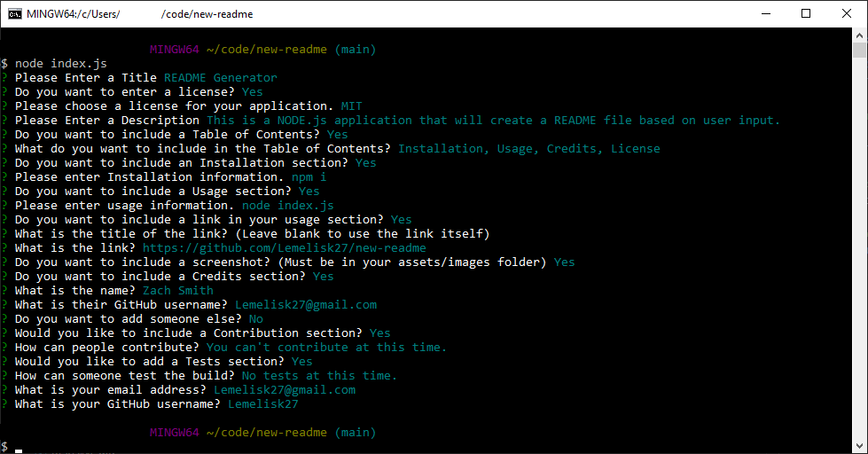

# README Generator
## Description
This is a NODE.js application that will create a README file based on user input.
## Usage
  

## Credits
Zach Smith - [GitHub Profile](https://github.com/Lemelisk27)  
## Questions  
If you have any questions you can contact me directly at Lemelisk27@gmail.com. You can also find more of my work on GitHub at [Lemelisk27](https://github.com/Lemelisk27)